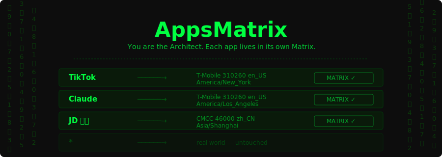
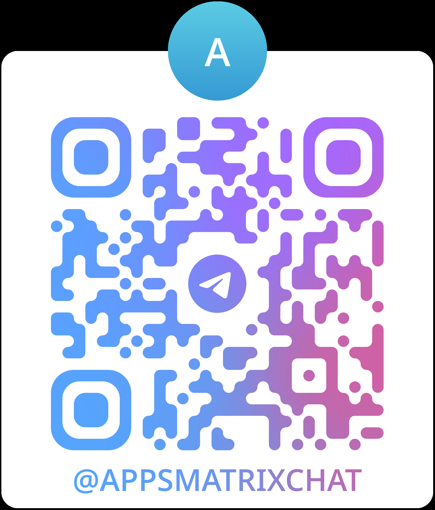

<p align="center">
  
</p>

<p align="center">
  <a href="../../releases/latest"></a>
  
  
  <a href="LICENSE"></a>
</p>

<p align="center"><b><a href="README.md">中文</a> | English</b></p>

An LSPosed module that constructs a **separate simulated environment** for each app — carrier, locale, timezone. TikTok sees T-Mobile in New York, Claude sees Los Angeles, JD sees China Mobile in Shanghai. Each app lives in its own Matrix. None of them can tell.

## Why

Global spoofing (`resetprop`) changes the environment for **all** apps at once. Chinese apps like JD/Taobao see foreign carrier info and trigger risk control. Foreign apps see Chinese locale and refuse to work. You can't have both.

AppsMatrix hooks APIs **per-process** — each app sees only the identity you assign to it. Everything else stays real.

## Install

1. Download APK from [**Releases**](../../releases/latest)
2. Install: `adb install -r apps-matrix.apk`
3. **LSPosed Manager** → enable **AppsMatrix** → check target apps
4. Reboot

Done. Each target app now lives in its Matrix.

## Config

Edit `app/src/main/assets/matrix.json` — one entry per app:

```json
{
  "com.zhiliaoapp.musically": {
    "label": "TikTok",
    "sim_operator": "310260",
    "sim_operator_name": "T-Mobile",
    "sim_country": "us",
    "network_operator": "310260",
    "network_operator_name": "T-Mobile",
    "network_country": "us",
    "locale_language": "en",
    "locale_country": "US",
    "timezone": "America/New_York"
  }
}
```

All fields must be **self-consistent** — US carrier + Chinese locale + Asian timezone will get flagged instantly.

<details>
<summary><b>Common carrier codes</b></summary>

| Country | Carrier | Code |
|---------|---------|------|
| US | T-Mobile | `310260` |
| US | AT&T | `310410` |
| US | Verizon | `311480` |
| CN | China Mobile | `46000` |
| CN | China Unicom | `46001` |
| CN | China Telecom | `46003` |
| JP | NTT Docomo | `44010` |
| UK | EE | `23430` |

</details>

## Limitations

- Config is baked into the APK — rebuild to change targets
- Java-level hooks only — NDK `__system_property_get` bypasses this
- SIM / network / locale / timezone only — no IMEI or device fingerprint

## Community

<a href="https://t.me/AppsMatrixChat"></a>

[**Join Telegram Group**](https://t.me/AppsMatrixChat) — feedback, discussion, update notifications.

## License

GPL-3.0
